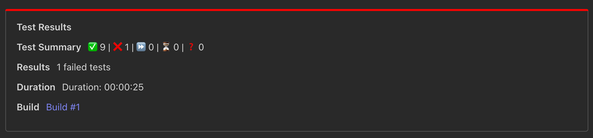
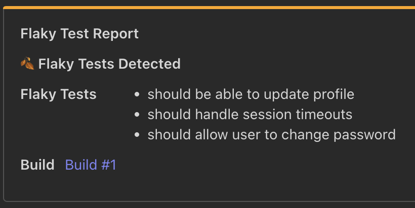

# Teams Test Results Notification

> Send Microsoft Teams message with test result from popular testing frameworks

A Microsoft Teams test reporting tool that supports all major testing frameworks. Generate, publish and alert your team with detailed test results, including summaries, in-depth reports, flaky test detection and AI analyses directly to your chosen Teams channel.

<div align="center">
<div style="padding: 1.5rem; border-radius: 8px; margin: 1rem 0; border: 1px solid #30363d;">
<span style="font-size: 23px;">💚</span>
<h3 style="margin: 1rem 0;">CTRF tooling is open source and free to use</h3>
<p style="font-size: 16px;">You can support the project with a follow and a star</p>

<div style="margin-top: 1.5rem;">
<a href="https://github.com/ctrf-io/microsoft-teams-test-reporter">

</a>
<a href="https://github.com/ctrf-io">

</a>
</div>
</div>

<p style="font-size: 14px; margin: 1rem 0;">
Maintained by <a href="https://github.com/ma11hewthomas">Matthew Thomas</a><br/>
Contributions are very welcome! <br/>
</p>
</div>

## Features

- **Send Test Results to Teams**: Automatically send test results to a Teams channel.
- **Send Flaky Test Details to Teams**: Automatically send flaky test details to a Teams channel.
- **Send AI generated Failed Test Summary to Teams**: Automatically send AI summary to a Teams channel.
- **Conditional Notifications**: Use the `--onFailOnly` option to send notifications only if tests fail.



## Setup

You'll need a CTRF report generated by your testing framework. [CTRF reporters](https://github.com/orgs/ctrf-io/repositories) are available for most testing frameworks and easy to install.

**No CTRF reporter? No problem!**

Use [junit-to-ctrf](https://github.com/ctrf-io/junit-to-ctrf) to convert a JUnit report to CTRF

### Create a Teams Incoming Webhook

Setup an incoming webhook by following instructions on [Teams documentation](https://learn.microsoft.com/en-us/microsoftteams/platform/webhooks-and-connectors/how-to/add-incoming-webhook?tabs=newteams%2Cdotnet)

### Set the Environment Variable

Set the webhook URL as an environment variable in your shell or CI environment:

```sh
export TEAMS_WEBHOOK_URL='https://hooks.teams.com/services/your/webhook/url'
```

Make sure to replace `'https://hooks.teams.com/services/your/webhook/url'` with your actual webhook URL.

You might want to store the webhook URL as a secret.

## Usage

To send the test results summary to Teams:

```sh
npx teams-ctrf results /path/to/ctrf-report.json
```


To send flaky test report to Teams:

```sh
npx teams-ctrf flaky /path/to/ctrf-report.json
```



To send ai test summary for failed tests to Teams:

```sh
npx teams-ctrf ai /path/to/ctrf-report.json
```

### Send Only on Failures

To send the test results summary to Teams only if there are failed tests, use the `--onFailOnly` option:

```sh
npx teams-ctrf results /path/to/ctrf-file.json --onFailOnly
```

or using the alias:

```sh
npx teams-ctrf results /path/to/ctrf-file.json -f
```

## Options

- `--onFailOnly, -f`: Send notification only if there are failed tests.

## Merge reports

You can merge reports if your chosen reporter generates multiple reports through design, parallelisation or otherwise.

The [ctrf-cli](https://github.com/ctrf-io/ctrf-cli) package provides a method to merge multiple ctrf json files into a single file.

After executing your tests, use the following command:

```sh
npx ctrf merge <directory>
```

Replace directory with the path to the directory containing the CTRF reports you want to merge.

## What is CTRF?

CTRF is a universal JSON test report schema that addresses the lack of a standardized format for JSON test reports.

**Consistency Across Tools:** Different testing tools and frameworks often produce reports in varied formats. CTRF ensures a uniform structure, making it easier to understand and compare reports, regardless of the testing tool used.

**Language and Framework Agnostic:** It provides a universal reporting schema that works seamlessly with any programming language and testing framework.

**Facilitates Better Analysis:** With a standardized format, programatically analyzing test outcomes across multiple platforms becomes more straightforward.

## Support Us

If you find this project useful, consider giving it a GitHub star ⭐ It means a lot to us.
